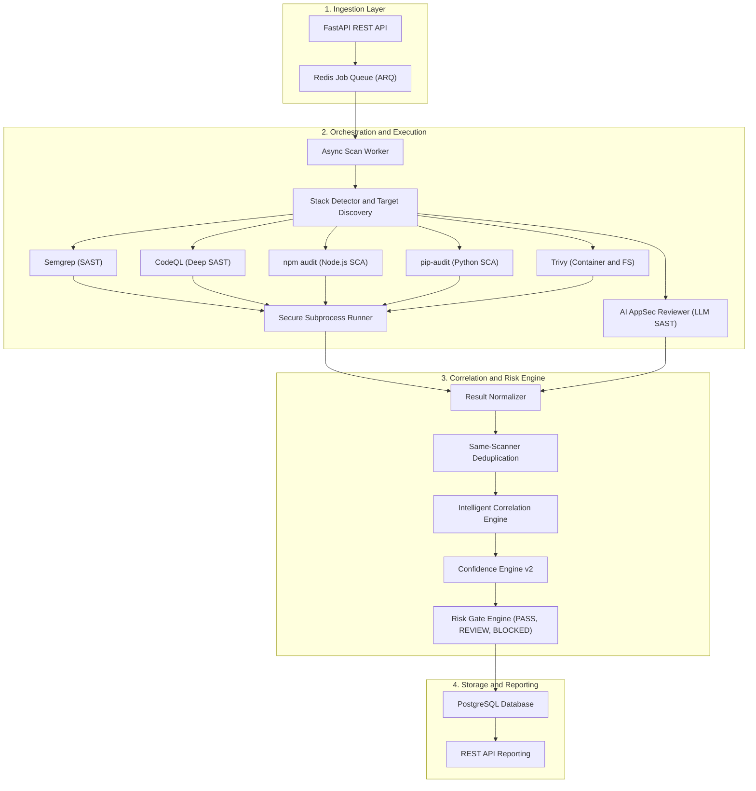
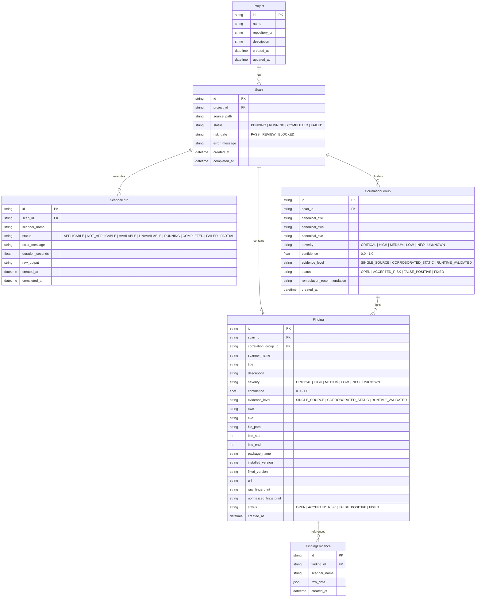
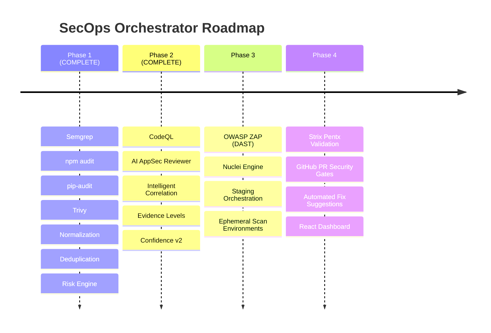

# SecOps Orchestrator

SecOps Orchestrator is an extensible DevSecOps security orchestration platform that automates multi-scanner vulnerability analysis, normalizes findings into a unified schema, performs same-scanner deduplication, cross-scanner correlation, confidence scoring, and evaluates automated risk gates.



---

## Features

- **Automated Stack Detection**: Automatically selects relevant scanners based on project manifests (`package.json`, `requirements.txt`, `pyproject.toml`, `Dockerfile`, source files).
- **Scanner Abstraction Layer (`ScannerAdapter`)**: Clean pluggable interface isolating scanner-specific logic.
- **Robust Failure Isolation**: Unavailable scanner binaries or failed executions report their run status without crashing the overall scan.
- **Secure Subprocess Execution**: Strict command sanitization, absolute path validation, symlink traversal prevention, execution timeouts, and memory-safe output limits.
- **Same-Scanner Deduplication**: Deterministic removal of redundant findings from the same scanner using standardized vulnerability fingerprints.
- **Intelligent Cross-Scanner Correlation**: Semantic clustering of related findings across distinct scanners based on common identifiers (CVE, CWE), package names, and source location proximity.
- **Confidence Scoring & Corroboration**: Evidence-weighted scoring (0.0–1.0) with corroboration bonuses when multiple scanners confirm a finding.
- **Risk Gate Engine**: Automated policy decisions (`PASS`, `REVIEW`, `BLOCKED`) based on vulnerability severity and confidence thresholds.
- **Asynchronous Architecture**: Non-blocking REST API backed by Redis and background workers.

---

## Supported Scanners (Phase 1 & Phase 2)

| Scanner | Target | Detection Trigger | Default Confidence |
| :--- | :--- | :--- | :--- |
| **CodeQL** (Optional) | Deep SAST (Dataflow / Taint) | Python (`.py`), JS/TS (`.js`, `.ts`, `package.json`) | 0.70 |
| **AI AppSec Reviewer** | LLM Heuristic SAST / Logic | When configured (`AI_APPSEC_ENABLED=true`) | 0.45 |
| **Semgrep** | SAST (Source code) | Any source code repository | 0.5 |
| **npm audit** | SCA (Node.js dependencies) | `package.json` | 0.7 (with CVE) / 0.5 |
| **pip-audit** | SCA (Python dependencies) | `requirements.txt` or `pyproject.toml` | 0.7 (with CVE) / 0.5 |
| **Trivy** | Container / FS / Config | `Dockerfile` | 0.7 (with CVE) / 0.5 |

> **CodeQL Integration (Optional)**: CodeQL is an optional third-party integration. SecOps Orchestrator does not distribute or install GitHub CodeQL CLI. SecOps checks whether `codeql` is available in the worker execution environment's `PATH`; if not found, it reports the scanner run status as `UNAVAILABLE` and the overall scan continues normally. Users who choose to install and enable CodeQL are solely responsible for obtaining any required license and ensuring their use complies with [GitHub's CodeQL Terms and Conditions](https://github.com/github/codeql-cli-binaries/blob/main/LICENSE.md). See [Setting up the CodeQL CLI](https://docs.github.com/en/code-security/codeql-cli/getting-started-with-the-codeql-cli/setting-up-the-codeql-cli) for official installation documentation. SecOps Orchestrator grants no rights to use CodeQL.

---

## Data Model



---

## Risk Gate Policy

| Finding Severity | Confidence Threshold | Risk Gate Result |
| :--- | :--- | :--- |
| **CRITICAL** | >= 0.5 | `BLOCKED` |
| **HIGH** | >= 0.7 | `BLOCKED` |
| **HIGH** | < 0.7 | `REVIEW` |
| **MEDIUM** | Any | `REVIEW` |
| **LOW / INFO** | Any | `PASS` |
| **None** | - | `PASS` |

---

## Security Architecture

The secure runner (`app.security.runner`) executes external tools with strict isolation guarantees:

- **No Shell Execution**: Uses `asyncio.create_subprocess_exec` directly; `shell=True` is prohibited.
- **Strict Argument Sanitization**: All arguments are passed as structured lists. Dangerous characters (`;`, `&`, `|`, `` ` ``, `$`, `\n`, `\r`, `\x00`) are blocked.
- **Path Traversal & Symlink Escape Prevention**: Working directories and target paths are resolved canonical paths validated strictly against configured allowed roots (`allowed_workspace_root`).
- **Resource Limits & Process Control**: Configurable timeouts (default 300s) terminate runaway processes with process kill cleanup, and stdout/stderr are capped at 50 MB to prevent memory exhaustion.
- **Environment Scrubbing**: Dangerous dynamic linking variables (`LD_PRELOAD`, `LD_LIBRARY_PATH`, `DYLD_INSERT_LIBRARIES`) are removed before spawning subprocesses.
- **Non-Privileged Containers**: Docker containers run under a dedicated unprivileged user (`secops:secops`).

---

## Getting Started

### Prerequisites

- Python 3.12+
- Docker & Docker Compose
- PostgreSQL 16+
- Valkey 8+ (or via Docker Compose)

### Environment Configuration

Copy the example environment file:

```bash
cp .env.example .env
```

### Local Development Setup

1. Create and activate a Python virtual environment:

```bash
python3 -m venv .venv
source .venv/bin/activate
```

2. Install dependencies in editable mode:

```bash
pip install -e "./backend[dev]"
```

3. Run database migrations:

```bash
cd backend
alembic upgrade head
```

4. Start the development server:

```bash
uvicorn app.main:app --reload --host 0.0.0.0 --port 8000
```

5. (Optional) Run the background worker:

```bash
python -m app.workers.scan_worker
```

---

## Running with Docker Compose

Start all services (PostgreSQL, Valkey, API, and Worker):

```bash
docker compose up -d --build
```

Services exposed:
- **API**: [http://localhost:8008](http://localhost:8008)
- **API Docs (Swagger)**: [http://localhost:8008/docs](http://localhost:8008/docs)
- **PostgreSQL**: `localhost:5432`
- **Valkey**: `localhost:6379`

---

## CLI (SecOps Local Operator)

The `secops` CLI provides an automated, developer-friendly interface to audit repositories, inspect scan reports, filter findings, and check stack health without manual API or Docker calls.

### Installation

```bash
./scripts/install-cli.sh
```
Or execute directly from the repository root via `./secops`.

### Usage

#### Source audit

```bash
# Audit source code and dependencies of a local repository
secops audit ~/projetos/meu-app
```

Analyzes committed source code and dependencies using static scanners (Semgrep, CodeQL [optional, if available in the worker execution environment's PATH], npm-audit, pip-audit, Trivy).

#### Source + DAST

```bash
# Audit source code AND scan a running application
secops audit ~/projetos/meu-app \
  --url https://app.example.com
```

Analyzes source code/dependencies **and** runs DAST scanners (ZAP, Nuclei) against the target URL.

#### DAST only

```bash
# Scan only a running application by URL (no source code required)
secops dast https://app.example.com
```

Runs **only** DAST scanners (ZAP and Nuclei) against the target URL. Does not require a local repository, Git, or source code.

```bash
# Additional examples
secops dast https://app.example.com --json
secops dast https://app.example.com --project-id <uuid>
```

#### Other commands

```bash
# Check infrastructure health
secops doctor

# Check CodeQL availability in worker and view setup guidance
secops codeql
secops codeql --json

# View the latest scan report
secops report

# View actionable findings filtered by severity
secops findings --severity medium

# Filter findings by scanner
secops findings --scanner zap
secops findings --scanner nuclei
```

### GitHub CodeQL (Optional)

SecOps Orchestrator does not download, distribute, install, or license GitHub CodeQL.

CodeQL is an optional third-party integration that provides deep static analysis and taint tracking across Python and JavaScript/TypeScript codebases. Users are responsible for ensuring their use complies with GitHub's terms and any required license.

#### Integration Workflow

1. Review [GitHub's CodeQL Terms and Conditions](https://github.com/github/codeql-cli-binaries/blob/main/LICENSE.md).
2. Install CodeQL on your host machine following GitHub's official documentation at [Setting up the CodeQL CLI](https://docs.github.com/en/code-security/codeql-cli/getting-started-with-the-codeql-cli/setting-up-the-codeql-cli).
3. Export the absolute path to your CodeQL installation directory:
   ```bash
   export SECOPS_CODEQL_HOME=/absolute/path/to/codeql
   ```
4. Recreate the worker service using the CodeQL overlay:
   ```bash
   docker compose \
     -f docker-compose.yml \
     -f docker-compose.codeql.yml \
     up -d --force-recreate worker
   ```
5. Verify the integration inside the worker:
   ```bash
   secops codeql
   ```
6. Run scans normally:
   ```bash
   secops audit ~/projetos/app
   ```

When CodeQL is present in the worker, it is automatically executed by the CodeQL scanner adapter. When CodeQL is absent, it is reported as `UNAVAILABLE` and all remaining scanners continue normally.

### Key Operational Behaviors

- **Committed HEAD only**: `audit` uses `git archive HEAD`; uncommitted working tree changes and stashes never enter the scan snapshot.

- **Project reuse & Carryover**: Dispositions persist per `project_id`. CLI automatically resolves and reuses existing project by repository remote URL or directory name. DAST-only projects are identified by normalized hostname (e.g., `DAST: app.example.com`).

- **DAST Security**: Target URLs are validated by the backend domain/private-IP allowlist (`SECOPS_DAST_ALLOWED_HOSTS`). The target must be a system you own and are authorized to test.

- **DAST mode**: ZAP runs in baseline (non-destructive) mode. Nuclei uses default safe templates. Neither performs active exploitation, brute force, or destructive fuzzing. DAST scans are currently unauthenticated unless custom scanner configuration supports authentication.

- **Production caution**: While scans are non-destructive by default, exercise appropriate caution when targeting production systems.

## Running Tests

Execute the automated test suite with coverage and linting:

```bash
# Run pytest with coverage
pytest --cov=app --cov-report=term-missing

# Run Ruff linter
ruff check .
```

---

## API Reference

### Health Check
- `GET /health` -> `{"status": "ok"}`

### Projects
- `POST /api/projects`
  - **Body**: `{"name": "string", "repository_url": "string?", "description": "string?"}`
  - **Response**: `201 Created`

### Scans
- `POST /api/scans`
  - **Body**: `{"project_id": "uuid", "source_path": "/path/to/repo"}`
  - **Response**: `202 Accepted`
- `GET /api/scans/{scan_id}`
  - **Response**: `200 OK` (Scan details, status, risk gate)
- `GET /api/scans/{scan_id}/scanner-runs`
  - **Response**: `200 OK` (List of scanner executions and individual statuses)
- `GET /api/scans/{scan_id}/findings`
- **Response**: `200 OK` (List of normalized, deduplicated findings)
- `GET /api/scans/{scan_id}/correlations`
- **Response**: `200 OK` (List of grouped correlation findings, evidence levels, and consolidated remediations)
- `GET /api/scans/{scan_id}/correlations/{correlation_id}`
- **Response**: `200 OK` (Details for a single correlation group)
- `GET /api/scans/{scan_id}/evidence-summary`
- **Response**: `200 OK` (Breakdown of findings by evidence level: SINGLE_SOURCE, CORROBORATED_STATIC, RUNTIME_VALIDATED)
- `GET /api/scans/{scan_id}/summary`
- **Response**: `200 OK` (Summary with severity totals, scanner statuses, and risk gate decision)

#### Example Summary Response:

```json
{
  "scan_id": "d92eac88-9d3a-4bd6-9c35-81aaeb63f130",
  "status": "COMPLETED",
  "risk_gate": "BLOCKED",
  "totals": {
    "critical": 1,
    "high": 3,
    "medium": 2,
    "low": 1,
    "info": 0,
    "unknown": 0
  },
  "scanner_runs": {
    "semgrep": "completed",
    "npm-audit": "completed",
    "pip-audit": "not_applicable",
    "trivy": "completed"
  }
}
```

---

## Architecture Roadmap



- **Phase 1 (COMPLETE)**: Semgrep, npm audit, pip-audit, Trivy, normalization, deterministic same-scanner deduplication, Risk Engine, FastAPI, PostgreSQL, Redis, Docker Compose.
- **Phase 2 (COMPLETE)**: CodeQL integration (SARIF 2.1.0, multi-language DBs), AI AppSec Reviewer (OpenAI-compatible abstraction, privacy controls, prompt injection defense), intelligent cross-scanner correlation engine, Evidence Levels (`SINGLE_SOURCE`, `CORROBORATED_STATIC`), Confidence Engine v2, database migration `002`, extended REST API endpoints (`/correlations`, `/evidence-summary`).
- **Phase 3 (PLANNED)**: OWASP ZAP (DAST), Nuclei engine, staging deployment security orchestration, ephemeral scan environments.
- **Phase 4 (PLANNED)**: Strix / Pentx automated PoC validation, GitHub PR Security Gates, automated remediation PRs, React Web Dashboard.

## License

SecOps Orchestrator is licensed under the **PolyForm Perimeter License 1.0.1** (source-available).

Under this license:
- You can use SecOps Orchestrator for personal and internal business purposes, including securing your own commercial software.
- You can modify and redistribute the software subject to the license terms.
- You may not provide a product or service that competes with SecOps Orchestrator.

See [LICENSE](LICENSE) for complete terms.

Third-party tools and libraries integrated by SecOps Orchestrator remain subject to their own licenses and terms. See [THIRD_PARTY_NOTICES.md](THIRD_PARTY_NOTICES.md) for details.
