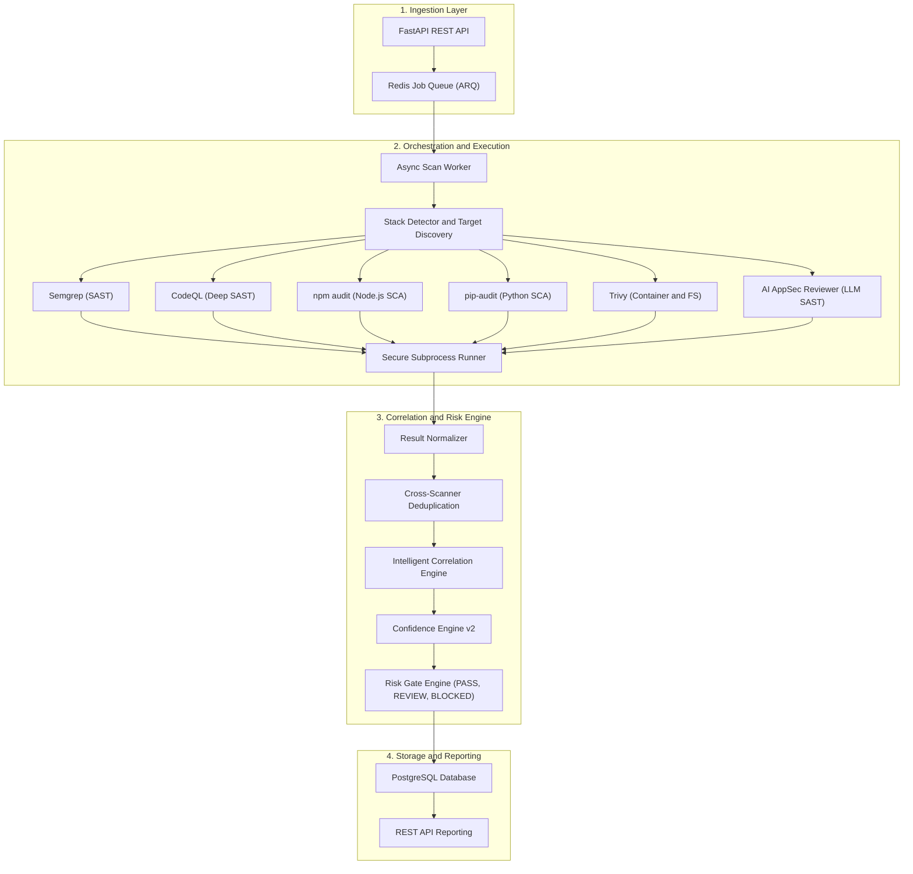
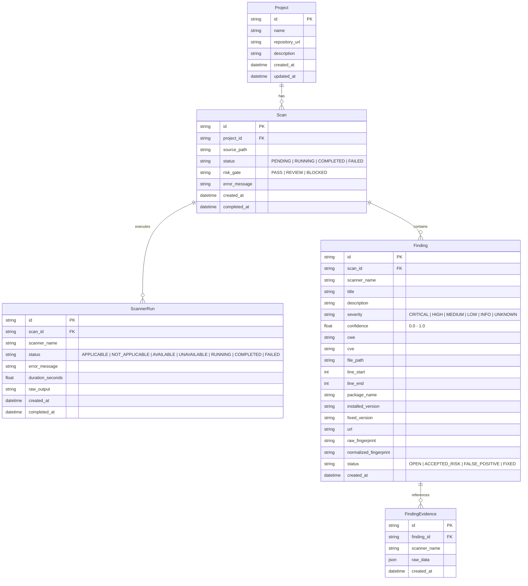
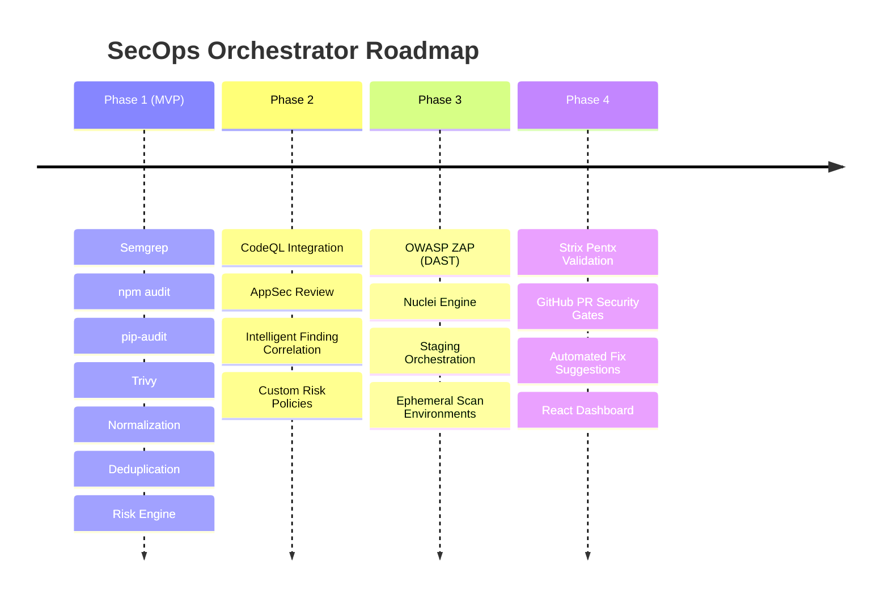

# SecOps Orchestrator

SecOps Orchestrator is an extensible DevSecOps security orchestration platform that automates multi-scanner vulnerability analysis, normalizes findings into a unified schema, performs cross-scanner deduplication and confidence scoring, and evaluates automated risk gates.



---

## Features

- **Automated Stack Detection**: Automatically selects relevant scanners based on project manifests (`package.json`, `requirements.txt`, `pyproject.toml`, `Dockerfile`, source files).
- **Scanner Abstraction Layer (`ScannerAdapter`)**: Clean pluggable interface isolating scanner-specific logic.
- **Robust Failure Isolation**: Unavailable scanner binaries or failed executions report their run status without crashing the overall scan.
- **Secure Subprocess Execution**: Strict command sanitization, absolute path validation, symlink traversal prevention, execution timeouts, and memory-safe output limits.
- **Deterministic Deduplication**: Cross-scanner finding correlation using standardized vulnerability fingerprints (CVE, CWE, affected package/file).
- **Confidence Scoring & Corroboration**: Evidence-weighted scoring (0.0–1.0) with corroboration bonuses when multiple scanners confirm a finding.
- **Risk Gate Engine**: Automated policy decisions (`PASS`, `REVIEW`, `BLOCKED`) based on vulnerability severity and confidence thresholds.
- **Asynchronous Architecture**: Non-blocking REST API backed by Redis and background workers.

---

## Supported Scanners (Phase 1)

| Scanner | Target | Detection Trigger | Default Confidence |
| :--- | :--- | :--- | :--- |
| **Semgrep** | SAST (Source code) | Any source code repository | 0.5 |
| **npm audit** | SCA (Node.js dependencies) | `package.json` | 0.7 (with CVE) / 0.5 |
| **pip-audit** | SCA (Python dependencies) | `requirements.txt` or `pyproject.toml` | 0.7 (with CVE) / 0.5 |
| **Trivy** | Container / FS / Config | `Dockerfile` | 0.7 (with CVE) / 0.5 |

---

## Data Model



---

## Risk Gate Policy

| Finding Severity | Confidence Threshold | Risk Gate Result |
| :--- | :--- | :--- |
| **CRITICAL** | >= 0.5 | `BLOCKED` |
| **HIGH** | >= 0.7 | `BLOCKED` |
| **HIGH** | < 0.7 | `REVIEW` |
| **MEDIUM** | Any | `REVIEW` |
| **LOW / INFO** | Any | `PASS` |
| **None** | - | `PASS` |

---

## Security Architecture

The secure runner (`app.security.runner`) executes external tools with strict isolation guarantees:

- **No Shell Execution**: Uses `asyncio.create_subprocess_exec` directly; `shell=True` is prohibited.
- **Strict Argument Sanitization**: All arguments are passed as structured lists. Dangerous characters (`;`, `&`, `|`, `` ` ``, `$`, `\n`, `\r`, `\x00`) are blocked.
- **Path Traversal & Symlink Escape Prevention**: Working directories and target paths are resolved canonical paths validated strictly against configured allowed roots (`allowed_workspace_root`).
- **Resource Limits & Process Control**: Configurable timeouts (default 300s) terminate runaway processes with process kill cleanup, and stdout/stderr are capped at 50 MB to prevent memory exhaustion.
- **Environment Scrubbing**: Dangerous dynamic linking variables (`LD_PRELOAD`, `LD_LIBRARY_PATH`, `DYLD_INSERT_LIBRARIES`) are removed before spawning subprocesses.
- **Non-Privileged Containers**: Docker containers run under a dedicated unprivileged user (`secops:secops`).

---

## Getting Started

### Prerequisites

- Python 3.12+
- Docker & Docker Compose
- PostgreSQL 16+ & Redis 7+ (or via Docker Compose)

### Environment Configuration

Copy the example environment file:

```bash
cp .env.example .env
```

### Local Development Setup

1. Create and activate a Python virtual environment:

```bash
python3 -m venv .venv
source .venv/bin/activate
```

2. Install dependencies in editable mode:

```bash
pip install -e "./backend[dev]"
```

3. Run database migrations:

```bash
cd backend
alembic upgrade head
```

4. Start the development server:

```bash
uvicorn app.main:app --reload --host 0.0.0.0 --port 8000
```

5. (Optional) Run the background worker:

```bash
python -m app.workers.scan_worker
```

---

## Running with Docker Compose

Start all services (PostgreSQL, Redis, API, and Worker with pre-installed scanner CLI tools):

```bash
docker compose up -d --build
```

Services exposed:
- **API**: [http://localhost:8000](http://localhost:8000)
- **API Docs (Swagger)**: [http://localhost:8000/docs](http://localhost:8000/docs)
- **PostgreSQL**: `localhost:5432`
- **Redis**: `localhost:6379`

---

## Running Tests

Execute the automated test suite with coverage and linting:

```bash
# Run pytest with coverage
pytest --cov=app --cov-report=term-missing

# Run Ruff linter
ruff check .
```

---

## API Reference

### Health Check
- `GET /health` -> `{"status": "ok"}`

### Projects
- `POST /api/projects`
  - **Body**: `{"name": "string", "repository_url": "string?", "description": "string?"}`
  - **Response**: `201 Created`

### Scans
- `POST /api/scans`
  - **Body**: `{"project_id": "uuid", "source_path": "/path/to/repo"}`
  - **Response**: `202 Accepted`
- `GET /api/scans/{scan_id}`
  - **Response**: `200 OK` (Scan details, status, risk gate)
- `GET /api/scans/{scan_id}/scanner-runs`
  - **Response**: `200 OK` (List of scanner executions and individual statuses)
- `GET /api/scans/{scan_id}/findings`
  - **Response**: `200 OK` (List of normalized, deduplicated findings)
- `GET /api/scans/{scan_id}/summary`
  - **Response**: `200 OK` (Summary with severity totals, scanner statuses, and risk gate decision)

#### Example Summary Response:

```json
{
  "scan_id": "d92eac88-9d3a-4bd6-9c35-81aaeb63f130",
  "status": "COMPLETED",
  "risk_gate": "BLOCKED",
  "totals": {
    "critical": 1,
    "high": 3,
    "medium": 2,
    "low": 1,
    "info": 0,
    "unknown": 0
  },
  "scanner_runs": {
    "semgrep": "completed",
    "npm-audit": "completed",
    "pip-audit": "not_applicable",
    "trivy": "completed"
  }
}
```

---

## Architecture Roadmap



- **Phase 1 (Current MVP)**: Semgrep, npm audit, pip-audit, Trivy, normalization, deduplication, confidence scoring, Risk Engine, FastAPI, PostgreSQL, Redis, Docker Compose.
- **Phase 2**: CodeQL integration, AppSec Review workflows, intelligent cross-scanner semantic correlation.
- **Phase 3**: OWASP ZAP and Nuclei integration for DAST and staging deployment security orchestration.
- **Phase 4**: Strix Pentx automated PoC validation, GitHub PR Integration & Security Gates, automated remediation PRs, React Web Dashboard.

## License

This project is licensed under the **PolyForm Noncommercial License 1.0.0**.

You may use, study, modify, and redistribute this software for noncommercial purposes.

**Commercial use is not permitted without a separate commercial license from the copyright holder.**

SPDX-License-Identifier: PolyForm-Noncommercial-1.0.0

> This project is source-available. The PolyForm Noncommercial License does not permit commercial use.
